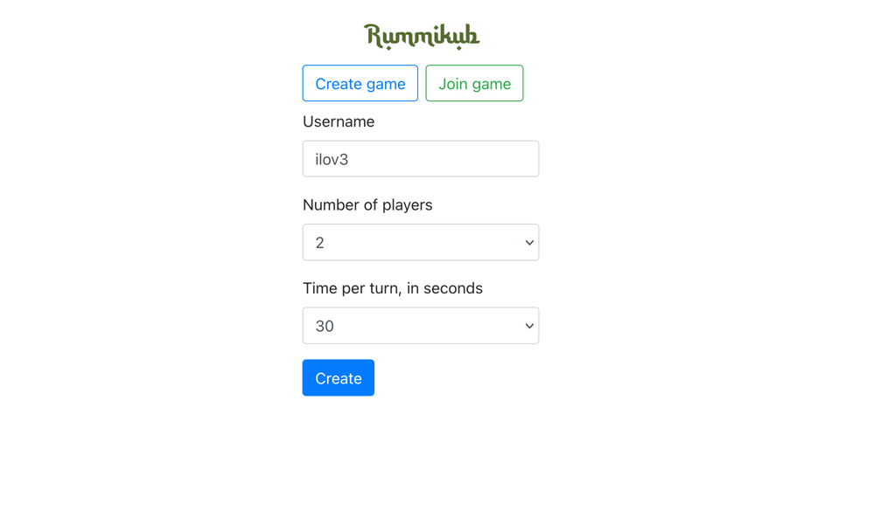
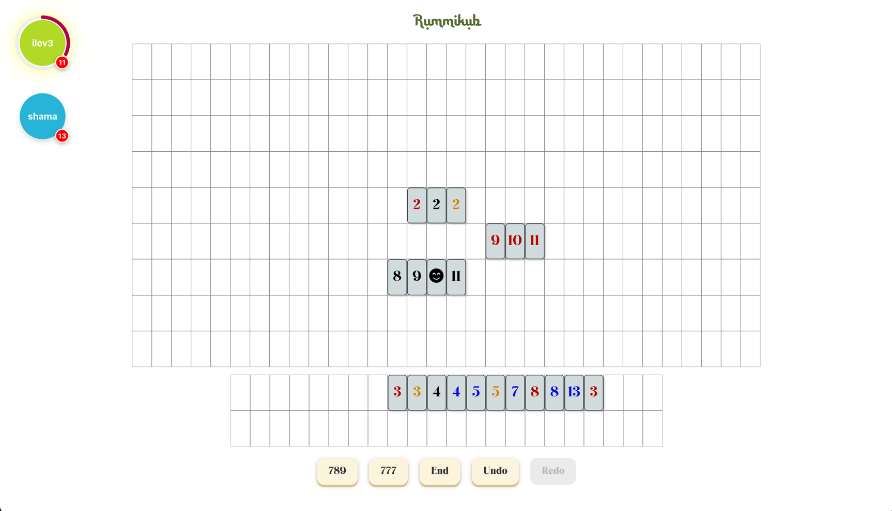

# Rummikub online multiplayer game

Implementation of [Rummikub](https://en.wikipedia.org/wiki/Rummikub) game variation. 
Was built using React + bunch of libraries "just for fun". First attempt on this technology, 
so the code is a little bit messy, hope to refactor someday :)

Some differences from original rules:
1. Tile with value "1" could be placed after "13" in a run (but not "2" after "1" in this case)
2. After first move ("initial meld") is done, player should pick two tile instead of one 
   (in case if he forced/wants to skip his turn)

### Features
- Online multiplayer 2-4 players
- Visualised turn timer
- Tile drag/drop including multi-tile selection (using `Shift` key)
- Achieved points results on game end

### Screenshots

Game creation


Game in progress


### Known limitations:
- Turn timeout handled on client-side, so there is a way to bypass it

### Local development
Make sure node/npm installed, currently game requires node v20

1. Create .env file and change env var values if needed
```shell
cp .env.example .env
```

2. Run npm install
```shell
npm install
```

3. Launch frontend
```shell
npm start
```

4. Launch dev backend sever
```shell
npm run serve
```

### Running tests
To run tests:
```shell
npm test
```
